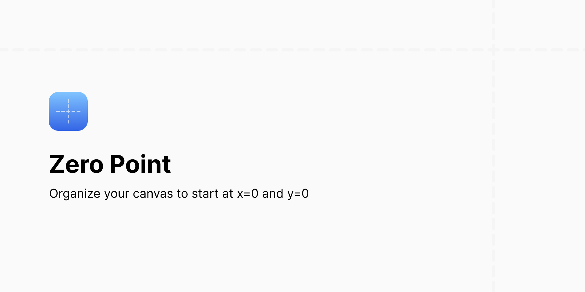

# Figma Zero Point

A Figma plugin for organizing layers on your canvas to x=0 and y=0.

[Install on Figma](https://www.figma.com/community/plugin/1008795501746481085)

## Usage

1. Go to the page you want to reorganize
2. Run the plugin: Menu > Plugins > Zero Point
3. Re-run the plugin: `Command + Option + P`
